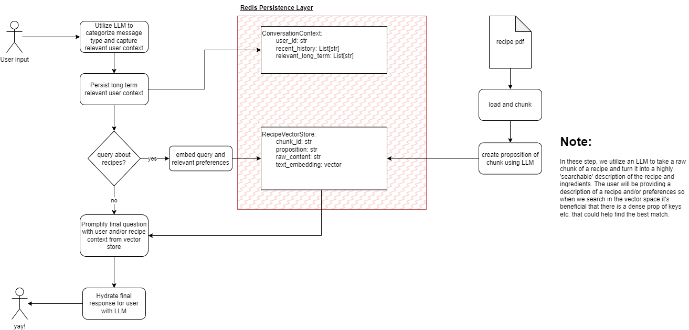
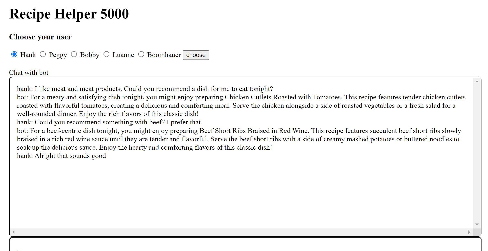
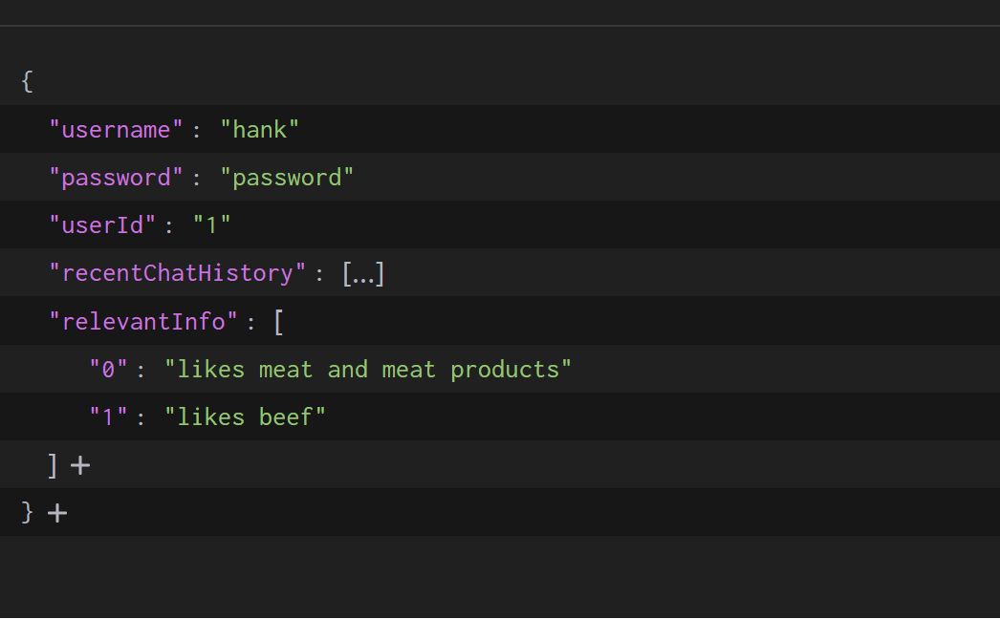
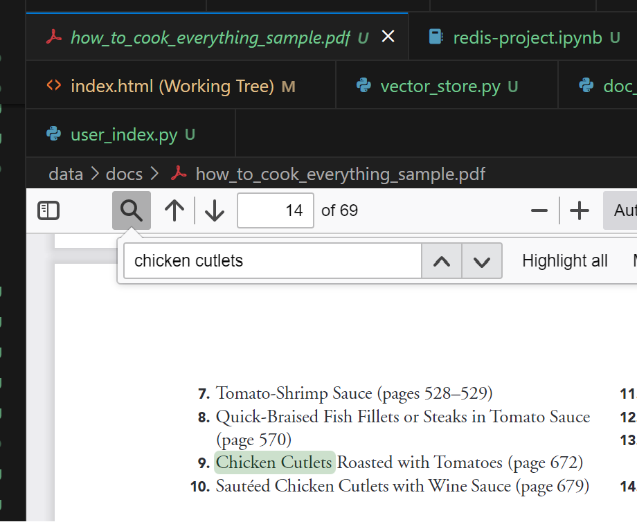

# Redis Chat Project by rbs333

The goal showcase fun recipe helper chat app using redis for memory layer.

## project overview diagram



## example usage

1. Hank asks for recs
   

2. Stored long term relevant preferences and last `n` chat messages.
   

3. Search in vector_store for like recipes
   

4. Return response and update memory layer

## TODOs: so many... no particular order

- add better serialization/deserialization for io.
- improve typing
- add testing
- get load user UI stuff working
- optimize prompts
- dockerize
- split user data model into different contexts
- better manage vector embeddings and test chunk sizes
- ...

## project structure

```
/api
  /static
    styles.css | static assets for FE
  /templates
    index.html | main FE file
  app.py | contains routes etc.
  requirements.txt
/chat_app
  chat.py | primary application code
/data
  /docs | docs for vectoring into store
/db
  vector_store.py | code for init of vector store
  user_index.py | code for init of user index
  llm_memory.py | accessor class for chat memory
  doc_vector.py | helper class for vector store
/utilities
  ... | reusable code chunks
/settings

.env
main.py
requirements.txt
```

## getting started

`pip install -r requirements.txt` //same for api if running

Using Redis Cloud must have instance running. Also, using Openai as LLM.

=> create .env of form:

```
OPENAI_API_KEY=
REDIS_URL=
REDIS_HOST=
REDIS_PASSWORD=
REDIS_PORT=
```

init db

```
python db/vector_store.py
python db/user_index.py
```

running app

```
cd api
flask run --debug
```

## references

https://github.com/RedisVentures/redisvl
https://github.dev/miguelgrinberg/Flask-SocketIO-Chat
